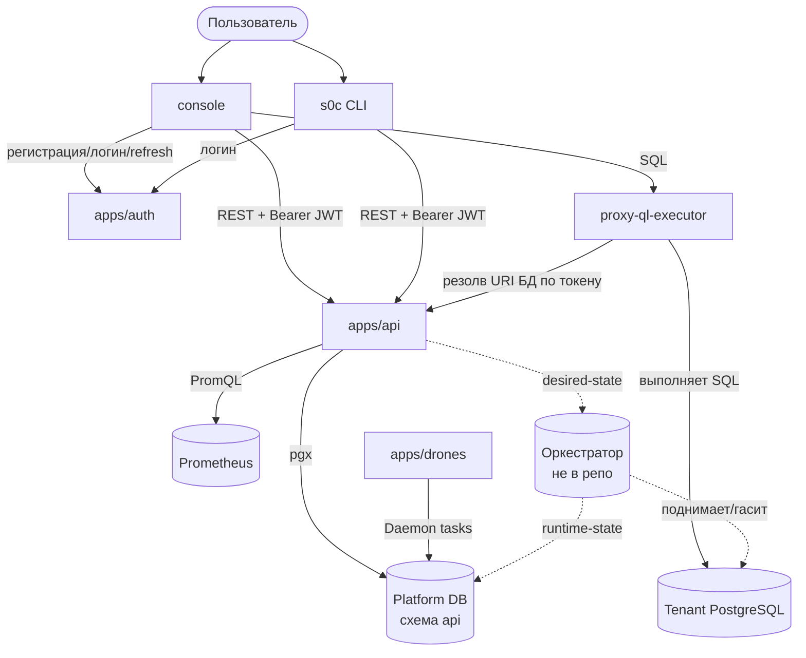

# Архитектура Sb0rka

Системный обзор всего монорепо: какие сервисы есть, за что отвечают и как взаимодействуют. Глубокие доки по частям — по ссылкам ниже.

| Документ | О чём |
| --- | --- |
| [apps/api/docs/architecture.md](apps/api/docs/architecture.md) | Внутреннее устройство Platform API (слои, потоки) |
| [db/SCHEMA.md](db/SCHEMA.md) | Схема БД (ER-диаграмма, таблицы) |
| [apps/console/ARCHITECTURE.md](apps/console/ARCHITECTURE.md) | Устройство веб-консоли |
| [apps/drones/README.md](apps/drones/README.md), [apps/s0c/README.md](apps/s0c/README.md), [apps/proxy-ql-executor/README.md](apps/proxy-ql-executor/README.md) | Отдельные сервисы |
| Swagger UI (`/swagger`) | Контракт Platform API (генерируется из кода) |

## Что это

Платформа управляемых PostgreSQL баз данных и зашифрованных секретов совместно с AI-агентами: пользователь создаёт проект, в нём — базы данных (каждая с изолированным инстансом и URI) и секреты. Управление через REST API, веб-консоль или CLI.

## Компоненты

| Компонент | Роль | В репозитории? |
| --- | --- | --- |
| `apps/api` | Platform API — ядро (проекты, БД, секреты, теги, телеметрия, RBAC) | ✅ |
| `apps/auth` | Auth API (регистрация, логин, JWT, refresh, сессии, организации) | ✅ |
| `apps/console` | Веб-консоль (React) | ✅ |
| `apps/s0c` | CLI (Go, cobra) | ✅ |
| `apps/drones` | Фоновые задачи | ✅ |
| `apps/proxy-ql-executor` | Serverless-исполнитель read-only SQL | ✅ |
| `packages/contract` | Общие DTO (api ↔ s0c) | ✅ |
| **Оркестратор инстансов** | Физически поднимает PostgreSQL по desired-state | ❌ не в репо |

## Как сервисы взаимодействуют

## Сквозные потоки

**Аутентификация.** Регистрацию, логин и refresh обслуживает `apps/auth` → клиент получает короткоживущий JWT (Ed25519). `apps/api` его только проверяет (не выдаёт) — оба используют один ключ. Мутации дополнительно требуют живой сессии (`auth.is_live_session` в БД).

**Создание базы.** console/s0c → `POST /dbi` к api. API в одной транзакции пишет desired-state: запись БД, password-секрет (зашифрован Tink AEAD + SCRAM-verifier), системный тег. Оркестратор (внешний) видит desired-state и физически поднимает PostgreSQL-инстанс, проставляя runtime-state. Детали — в [api/docs/architecture.md](apps/api/docs/architecture.md).

**Выполнение SQL.** console → `POST /query` к proxy-ql-executor с bearer-токеном. Proxy резолвит URI базы через api (по токену), открывает своё соединение к tenant-БД, выполняет read-only SQL, закрывает соединение. Ноль состояния в глобалах.

**Удаление.** API помечает базу `desired_runtime_state='terminated'`, а её password-секрет — `password_desired_state='absent'`; оркестратор гасит инстанс и ставит `runtime_state='deleted'`; затем `drones` зачищает метаданные (ресурс БД + секрет + тег) функцией `cleanup_one_deleted_dbi()`.

## Локальный запуск

Полный прод-сценарий локально невозможен (нет оркестратора). Что поднимается из репо и как — в `docker-compose.dev.yml` и навыке `.claude/skills/local-dev`. Кратко: Postgres + миграции + auth + api + drones + proxy; токен получают регистрацией и логином через `apps/auth`; реальные tenant-инстансы не поднимаются (нет оркестратора).
