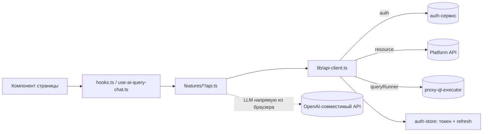

# Архитектура веб-консоли

Внутреннее устройство `apps/console`. Общая картина системы — в [корневом ARCHITECTURE.md](../../ARCHITECTURE.md).

## Стек

React 18 + Vite + TypeScript + Tailwind. UI — Radix + `class-variance-authority`. Данные с сервера — TanStack Query. Роутинг — react-router 7. Локализация — i18next (ru/en).

## Структура

Feature-based: `src/features/<feature>/` — на фичу свои `api.ts` (HTTP-вызовы), `hooks.ts` (TanStack Query), компоненты.

```
src/
├── App.tsx                 маршруты + провайдеры (Query, Auth, Theme, Tooltip, Toast, Confirm)
├── features/
│   ├── auth/               логин/регистрация, AuthProvider, RequireAuth
│   ├── projects/           основной модуль: проекты, БД, секреты, теги,
│   │                       data-explorer, AI-SQL, метрики
│   ├── subscription/       планы/квоты
│   └── user/               профиль
├── components/
│   ├── ui/                 общие примитивы (Radix + cva)
│   └── layout/             каркас (header, sidebar, app-layout)
└── lib/
    ├── api-client.ts       HTTP-ядро: 4 базовых URL + refresh токена
    ├── query-client.ts     конфиг TanStack Query
    ├── auth-store.ts        токен в localStorage + авто-refresh
    └── i18n.ts             i18next
```

## Маршруты и страницы

Из `src/App.tsx`. Публичные — `/login`, `/register`. Остальное под `RequireAuth` → `AppLayout`:

| Путь | Страница | Назначение |
| --- | --- | --- |
| `/projects` | `ProjectsPage` | список проектов |
| `/projects/:id` | `ProjectDetailPage` | вкладки: overview / databases / secrets / settings / metrics |
| `/projects/:id/data-explorer` | `DataExplorerPage` | интерактивный SQL + AI-ассистент |
| `/projects/:id/databases/:resourceId` | `DatabaseDetailPage` | схема БД (таблицы/колонки) |
| `/projects/:id/databases/:resourceId/query` | `DatabaseQueryPage` | SQL-терминал с выполнением |
| `/projects/:id/metrics/:metric` | `MetricDetailPage` | график метрики |
| `/subscription` | `SubscriptionPage` | подписка |
| `/profile` | `ProfilePage` | профиль |
| `*` | → `/projects` | редирект |

## Поток данных



Компоненты не делают `fetch` напрямую — только через хуки (TanStack Query) → `api.ts` → `api-client.ts`. Исключение по смыслу — PoC LLM-вызовы идут из браузера напрямую к стороннему OpenAI-совместимому API (не через наш бэкенд).

## Слой данных (`src/lib`)

- **`api-client.ts`** — весь HTTP. Знает **4 базовых URL** (env `VITE_*`): `auth` (логин/refresh/user), `resource` (Platform API), `queryRunner` (выполнение SQL), `nl2sql`. Сам обновляет access-токен через `POST /auth/refresh` при 401 (дедупликация параллельных refresh). Новые вызовы добавляются сюда, базовые адреса не дублируются.
- **`auth-store.ts`** — access-токен в `localStorage`; планирует авто-refresh, парся `exp` из JWT и обновляя токен незадолго до истечения.
- **`query-client.ts`** — TanStack Query: `staleTime` 5 мин, `retry` 1, без `refetchOnWindowFocus`.

## AI-генерация SQL (главная фича)

Ассистент, превращающий запрос на естественном языке в SQL, проверяющий и объясняющий его. Логика — `features/projects/use-ai-query-chat.ts` (~830 строк), LLM-вызовы — `features/projects/api.ts`.

**Ключевое:** запросы к модели идут **из браузера напрямую** к OpenAI-совместимому API. URL и ключ берутся из секретов проекта `LLM_BASE_URL` и `LLM_API_KEY` (если ключ пуст — ошибка «Secret LLM_API_KEY is empty»). Стриминг — через `POST {LLM_BASE_URL}/responses` (SSE), fallback — `/chat/completions`.

### Уровни reasoning

`resolveReasoningPolicy` задаёт глубину проверок (`maxCorrectnessPasses` — сколько проходов проверки корректности, `runFurtherSteps` — запускать ли оптимизацию):

| Уровень | Проверок корректности | Оптимизация | Поведение |
| --- | --- | --- | --- |
| `low` | 0 | нет | генерация → объяснение |
| `medium` | 2 | нет | генерация → до 2× (проверка корректности → fix) → объяснение |
| `high` | 3 | да | генерация → до 3× проверка → проверка оптимальности → выбор лучшего → объяснение |

### Поток при отправке промпта (генерация)

1. **Генерация** — `generateSqlWithOpenAiStream` → текущий SQL.
2. **Корректность** (если проходов > 0): в цикле `reviewSqlCorrectness` — статус `correct` (выход) или `rewrite` (берём новый SQL, повторяем до лимита).
3. **Оптимальность** (только `high`): `reviewSqlOptimality` → если `alternative`, то `resolveOptimalSql` выбирает финальный между корректным и альтернативным.
4. **Объяснение** — `explainSqlWithOpenAiStream` с финальным SQL и выбранным стилем (`none`/`detailed`/`short`/`haiku`, см. `explain-styles.ts`).

Исправление ошибок (когда запрос упал) — отдельный двухфазный поток `fixSqlWithOpenAiStream`: сначала диагноз (explanation), затем исправленный SQL (`onSqlPhaseStart` разделяет фазы).

### Типы сообщений чата

Пользовательские: `UserTextMessage` (текст промпта), `UserFixMessage` (SQL + текст ошибки). Ассистента: `SqlMessage` (готовый SQL), `ExplanationMessage` (объяснение + стиль), `FixMessage` (диагноз + исправленный SQL), `ThinkingMessage` (reasoning, сворачиваемый), `ErrorMessage`.

### Выполнение SQL

Готовый SQL выполняется не через api, а через **proxy-ql-executor**: `runDatabaseQuery({project_id, database_id, query})` → `POST {VITE_QUERY_RUNNER_BASE_URL}/query` → `{columns, rows, duration_ms, row_count, truncated}`. Схема БД для подсказок ассистенту подтягивается тем же путём (`fetchQueryRunnerSchema` — интроспекция information_schema).

## Конвенции

- Любой пользовательский текст — через i18next (`src/lib/i18n.ts`), ru и en сразу. Без захардкоженных строк в JSX.
- Данные с сервера — только через TanStack Query (`hooks.ts`), не голый `fetch` в компонентах.
- HTTP — через `api-client.ts`, без дублирования базовых адресов.
- Ответы внешних API (особенно LLM) проверяй структурно, не парси как `Record<string,unknown>` вслепую.

> Технический долг (см. план улучшений): `api.ts` (~1570 строк) и `use-ai-query-chat.ts` (~830) разрослись — кандидаты на разбиение; большие компоненты `detail-timeseries-chart.tsx` (~660), `database-detail-page.tsx` (~780).
