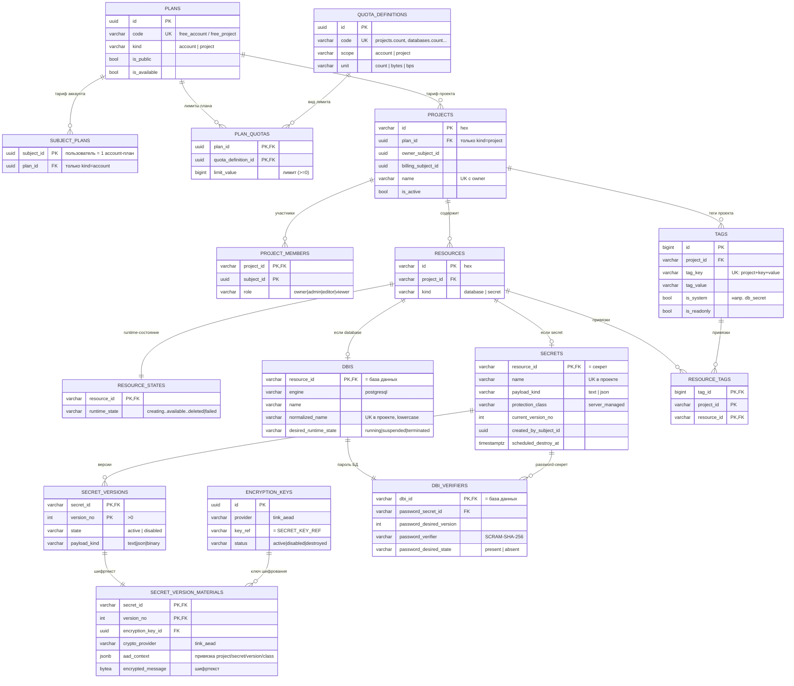

# Схема платформенной БД

Схема платформы — `api` (PostgreSQL). Миграции лежат в [`migrations/platform`](migrations/platform),
применяются по порядку (`NNN-name.sql`) с psql-переменными `:"DB_API_SCHEMA_NAME"` и
`:"DB_DRONE_MAPPING_USER"`. Запросы кода идут без префикса схемы → полагаются на `search_path`.

> При изменении схемы обновляйте этот файл (диаграмму и описания) вместе с миграцией.

## ER-диаграмма

## Таблицы

### Служебное

- **`version_platform`** — версия применённых миграций (одна строка `version_num`).

### Планы и квоты (биллинг)

- **`plans`** — каталог тарифов. `code` уникален; `kind` = `account` | `project`.
- **`subject_plans`** — account-план пользователя. PK = `subject_id` (один план на пользователя), триггер требует `kind='account'`.
- **`quota_definitions`** — справочник видов лимитов (`code`, `scope`, `unit`).
- **`plan_quotas`** — значения лимитов плана. PK = (`plan_id`, `quota_definition_id`); триггер требует совпадения scope квоты и kind плана. Отсутствие строки = безлимит.

### Проекты

- **`projects`** — контейнер ресурсов. `id` hex; ссылается на project-план; уникальность (`owner_subject_id`, `name`).
- **`project_members`** — участники и роли (`owner`|`admin`|`editor`|`viewer`) — основа RBAC. PK = (`project_id`, `subject_id`).

### Ресурсы

- **`resources`** — общий контейнер; `kind` = `database` | `secret`. Составные уникальности `(id, project_id, kind)` — основа строгих FK у потомков.
- **`resource_states`** — фактическое runtime-состояние (FSM `creating`→`available`→…→`deleted`/`failed`). PK = `resource_id`.
- **`dbis`** — детали инстанса БД (ресурс kind=`database`). `normalized_name` (lowercase) уникален в проекте; `desired_runtime_state` = `running`|`suspended`|`terminated`.

### Секреты и шифрование

- **`encryption_keys`** — метаданные ключей шифрования (не сам материал). Частичный уникальный индекс: один `active`-ключ на провайдера.
- **`secrets`** — секрет (ресурс kind=`secret`). `name` уникален в проекте; `current_version_no`; `payload_kind` = `text`|`json`.
- **`secret_versions`** — immutable версии. PK = (`secret_id`, `version_no`); `state` = `active`|`disabled`.
- **`secret_version_materials`** — зашифрованное значение версии: `encryption_key_id`, `aad_context` (JSONB, привязка к контексту), `encrypted_message` (BYTEA). Envelope-шифрование, разнесённое с метаданными.
- **`dbi_verifiers`** — связка база↔password-секрет в desired-state модели: `password_verifier` (SCRAM-SHA-256), `password_desired_state` = `present`|`absent`. По нему GC понимает, что пароль пора убрать.

### Теги

- **`tags`** — теги проекта (`tag_key`/`tag_value`), уникальность (`project_id`, `tag_key`, `tag_value`). Системный тег `db_secret` связывает базу с её секретом.
- **`resource_tags`** — привязка тегов к ресурсам (M:N). PK = (`project_id`, `resource_id`, `tag_id`).

## Ключевые паттерны

1. **`resources` — единая точка наследования.** База (`dbis`) и секрет (`secrets`) делят `id`+`project_id`+`kind`; составные FK `(id, project_id, kind)` не дают перепутать тип и защищены cross-project mismatch.
2. **Desired vs runtime.** Намерение пишет API (`dbis.desired_runtime_state`, `dbi_verifiers.password_desired_state`), факт отражает реконсилятор (`resource_states.runtime_state`). Расхождение — сигнал фоновым процессам, данные поля редактируются только API, а состояние инфраструктуры отражено в `resource_states` - таблице состояний запрещенной для изменения из API.
3. **Секрет нигде не лежит открыто.** Только зашифрованный материал + SCRAM-verifier; AAD привязывает шифртекст к `project/secret/version/class`.
4. **Связка база↔секрет тройная.** `dbis` ↔ `dbi_verifiers` ↔ `secrets` + системный тег `db_secret`. Эту тройку зачищает GC-дрон при удалении базы (`cleanup_one_deleted_dbi()`).
5. **Биллинг отделён.** Аккаунт-квоты — по `subject_plans`, проектные — по `projects.plan_id`.

У всех таблиц `created_at`/`updated_at` с триггером `set_updated_at` для трекинга изменений.
