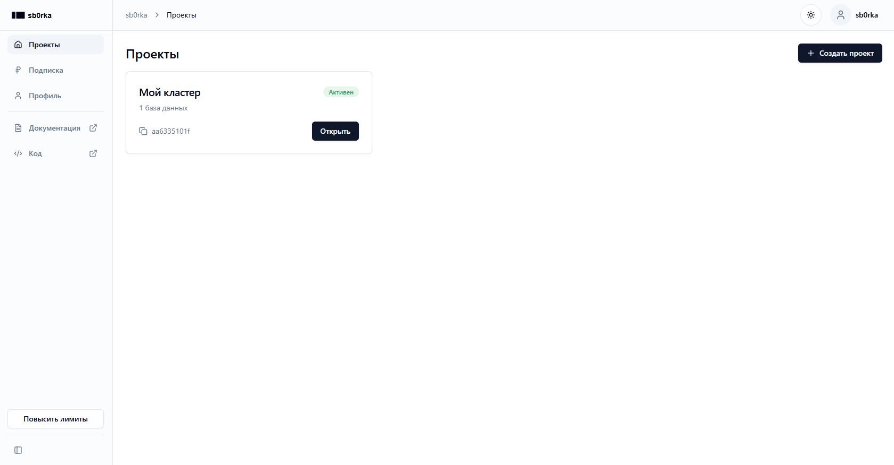
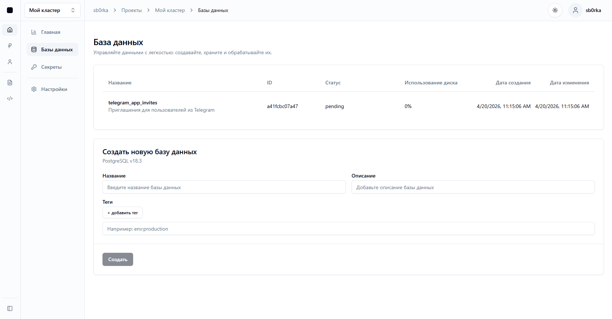
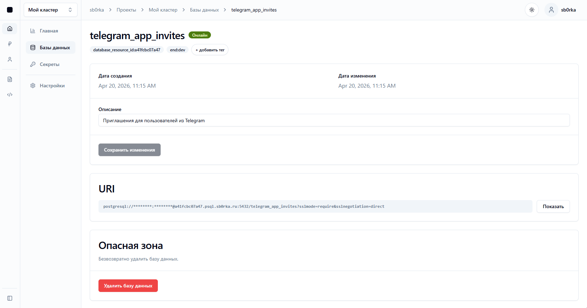

Sb0rka Console is the web interface for managing your projects and databases. It lets you create your first project, provision a database, and retrieve a ready-to-use connection string for any application.

Open [https://sb0rka.ru/console](https://sb0rka.ru/console), then sign in to your existing account or create a new one.

## Getting started

### Create your first project

After signing in, create your first project. A project is the main container for your resources, including databases.

### Create a database

Open the project you created, switch to the databases tab, and create a new database. At this step, Sb0rka automatically prepares the resource so it is ready to use.

### Copy the connection URI

Open the page for the database you created. There you will find the `connection URI` - a ready-made connection string that you can paste into your application, use in a PostgreSQL client, or store in an environment variable such as `DATABASE_URL`.

After that, the database is ready to use and can be connected to from any compatible tool or service.
